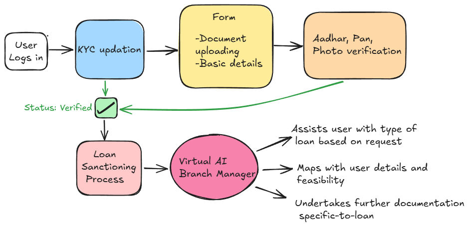

# Virtual Branch Manager

This project is an AI-powered Virtual Branch Manager designed to assist users with personal credit management. It features a backend built with Python (using FastAPI or Flask) and a frontend developed in React. The application includes functionalities for user authentication, document uploads for OCR processing, and AI-driven eligibility checks.

## Demo Video

<!-- You can watch the demo video [](https://www.youtube.com/watch?v=6b35r9mIXZ4) -->
You can watch the demo video [](https://private-user-images.githubusercontent.com/114304107/424308568-1c6b7716-7b97-466b-8fc4-cde3136a24ba.mp4?jwt=eyJhbGciOiJIUzI1NiIsInR5cCI6IkpXVCJ9.eyJpc3MiOiJnaXRodWIuY29tIiwiYXVkIjoicmF3LmdpdGh1YnVzZXJjb250ZW50LmNvbSIsImtleSI6ImtleTUiLCJleHAiOjE3NDIzNjM5NTMsIm5iZiI6MTc0MjM2MzY1MywicGF0aCI6Ii8xMTQzMDQxMDcvNDI0MzA4NTY4LTFjNmI3NzE2LTdiOTctNDY2Yi04ZmM0LWNkZTMxMzZhMjRiYS5tcDQ_WC1BbXotQWxnb3JpdGhtPUFXUzQtSE1BQy1TSEEyNTYmWC1BbXotQ3JlZGVudGlhbD1BS0lBVkNPRFlMU0E1M1BRSzRaQSUyRjIwMjUwMzE5JTJGdXMtZWFzdC0xJTJGczMlMkZhd3M0X3JlcXVlc3QmWC1BbXotRGF0ZT0yMDI1MDMxOVQwNTU0MTNaJlgtQW16LUV4cGlyZXM9MzAwJlgtQW16LVNpZ25hdHVyZT02MzJhOGFhMzFmZGViODNhZDZhYTQ5YzgzZWM0OWYyZGVmNWU4OWUxMTkxYmQwMGY2MWZkZjMzNmYwMDAyOTc3JlgtQW16LVNpZ25lZEhlYWRlcnM9aG9zdCJ9.RxzbR2Oiqu3itfwYJP6k5Ba_G5JNo6YiHA6BUmCA9MY)

## Project Structure


```
virtual-branch-manager
├── backend
│   ├── app.py
│   ├── config
│   │   ├── __init__.py
│   │   └── settings.py
│   ├── controllers
│   │   ├── __init__.py
│   │   └── user_controller.py
│   ├── models
│   │   ├── __init__.py
│   │   └── user.py
│   ├── services
│   │   ├── __init__.py
│   │   ├── ocr_service.py
│   │   └── ai_service.py
│   ├── utils
│   │   ├── __init__.py
│   │   └── helpers.py
│   ├── requirements.txt
│   └── Dockerfile
├── frontend
│   ├── public
│   │   └── index.html
│   ├── src
│   │   ├── components
│   │   │   ├── Dashboard.jsx
│   │   │   ├── Login.jsx
│   │   │   └── OCRUpload.jsx
│   │   ├── services
│   │   │   └── api.js
│   │   ├── App.js
│   │   └── index.js
│   ├── package.json
│   └── Dockerfile
├── database
│   └── schema.sql
├── docker-compose.yml
└── README.md
```

## Setup Instructions

### Backend

1. Navigate to the `backend` directory.
2. Install the required dependencies listed in `requirements.txt`.
3. Run the application using the command: `python app.py`.

### Frontend

1. Navigate to the `frontend` directory.
2. Install the necessary packages using `npm install`.
3. Start the React application with the command: `npm start`.

### Database

1. Execute the SQL statements in `schema.sql` to set up the database schema.

### Docker

To run the application using Docker, use the `docker-compose.yml` file to build and start all services.

## Usage Guidelines

- Users can register and log in to access their dashboard.
- Document uploads for OCR processing can be done through the OCR upload component.
- The application provides AI-driven insights based on user data and uploaded documents.

## Workflow



The workflow of the Virtual Branch Manager is as follows:

1. **User Registration and Authentication**: Users register and log in to the application.
2. **Document Upload**: Users upload documents through the OCR upload component.
3. **OCR Processing**: The backend processes the uploaded documents using OCR to extract relevant information.
4. **AI Eligibility Check**: The extracted information is analyzed by the AI service to determine user eligibility for various financial products.
5. **Dashboard**: Users can view their eligibility results and other insights on their dashboard.

## Features

### Loan Advisor Bot
- AI-powered chatbot for loan consultation
- Real-time eligibility assessment
- Document verification (Aadhar, PAN)
- Income assessment
- Available loan products information
- Interactive conversation interface

### Database Schema
- User management with detailed profile information
- Loan application tracking
- Employment and income verification
- Timestamp-based tracking for all records

### Key Components

1. **User Authentication & Profile**
   - Personal details storage
   - Income and employment verification
   - Document management (Aadhar, PAN)

2. **Loan Management**
   - Multiple loan product options
   - Real-time application status tracking
   - Automated eligibility assessment
   - Interest rate information

3. **Chat Interface**
   - Interactive conversation with AI bot
   - Context-aware responses
   - Document verification assistance
   - Loan product recommendations

## Technical Requirements

### Backend Dependencies
```python
# Core Dependencies
fastapi
python-dotenv
streamlit
langchain_core
langchain_groq

# ML & Data Processing
numpy
pandas
scikit-learn
xgboost
scipy
imbalanced-learn

# WebSocket & API
websockets
python-multipart
uvicorn

# Database
sqlalchemy
psycopg2-binary
```

## Machine Learning Model

The loan approval system uses an XGBoost classifier trained on the following features:

### Features Used
- Numerical Features:
  - Person age
  - Person income
  - Employment length
  - Loan amount
  - Loan interest rate
  - Loan percent income

- Categorical Features:
  - Person home ownership
  - Loan intent
  - Loan grade
  - Person default history

### Model Performance
- The model achieves high accuracy in predicting loan approvals
- Uses SMOTE for handling imbalanced data
- Includes feature importance analysis
- Implements hyperparameter tuning via GridSearchCV

### Model Pipeline
1. Data Preprocessing
   - Standardization of numerical features
   - One-hot encoding of categorical features
   - Outlier detection and removal
   - Missing value handling

2. Feature Engineering
   - Feature scaling
   - Categorical encoding
   - Feature selection based on importance

3. Model Training
   - Cross-validation
   - Hyperparameter optimization
   - Model evaluation using classification metrics

## API Endpoints

### FastAPI Backend

```python
# Main endpoints
GET / - Welcome message
POST /predict/ - Loan prediction endpoint
WS /ws/kyc/{session_id} - WebSocket for KYC process
```

### WebSocket Features
- Real-time chat functionality
- KYC verification process
- Document validation
- Loan eligibility checks
- AI-powered conversation flow

### Session Management
- Secure user sessions
- Real-time updates
- Document processing status
- Loan application tracking

## Video KYC Integration

The system includes a video KYC feature with:
- Real-time video streaming
- Document verification
- Face matching
- Identity validation
- Secure WebSocket communication

### WebRTC Features
- Peer-to-peer video calls
- Document capture
- Face detection
- Real-time chat during KYC
- Session recording capabilities

## Contributing

Contributions are welcome! Please submit a pull request or open an issue for any enhancements or bug fixes.